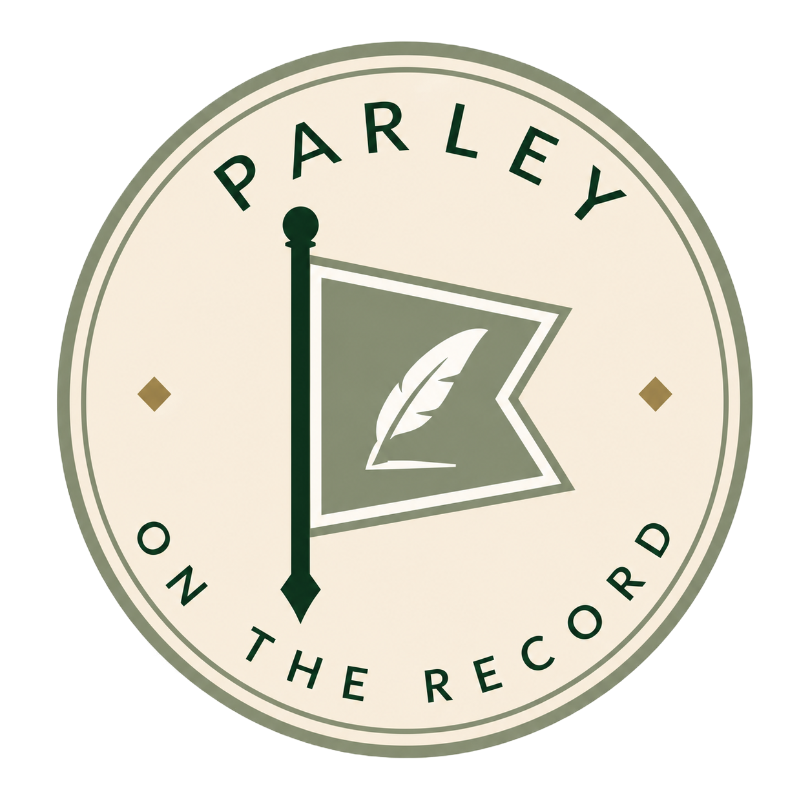

# Local-first systems for durable agent work

I build infrastructure for agents and operators—systems

CS @ Cal Poly San Luis Obispo.

## Projects

### [Monde ↗](https://github.com/nkuhanas/Monde) — Give agents a world to work in.

&nbsp;&nbsp;

A local-first runtime and control plane for autonomous agents working inside
real project directories. Monde gives agents bounded execution, operational
memory, and durable run evidence across a web console, CLI, and MCP service.

**Interfaces:** Web console · CLI · MCP 
**Storage:** SQLite 
**Status:** Active development

### [Docket ↗](https://github.com/nkuhanas/Docket) — Turn what you mean into what gets done.

A structured execution layer that turns operator intent into typed, inspectable
actions. Docket provides immutable previews, durable authorization, and auditable
execution evidence, with calendar automation and reminders as its first
operational surface.

**Focus:** Intent → typed changes → execution 
**Interfaces:** Web application · Calendar integrations 
**Status:** Active development

### [Parley ↗](https://github.com/nkuhanas/Parley) — Long-running agent work, without losing the thread.

A durable coordination backend for long-running and multi-agent workflows.
Parley preserves identity, obligations, plans, artifacts, effects, relationships,
and recovery state across restarts, context loss, and human handoffs.

**Focus:** Durable coordination · Recovery · Multi-agent state 
**Role:** Harness-agnostic backend
